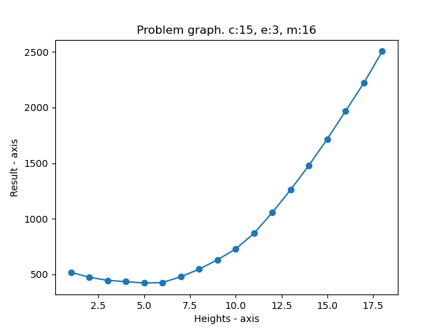
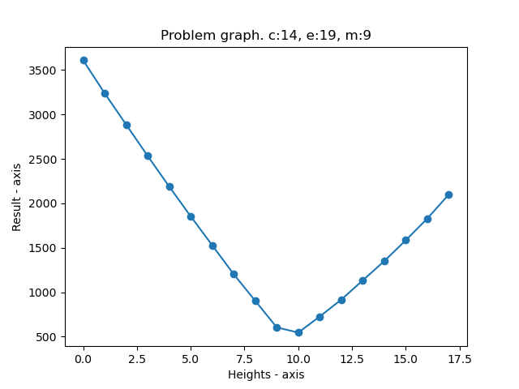
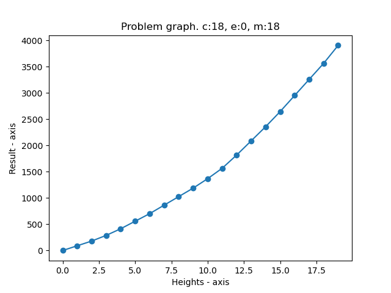

# Informe sobre solución al problema: ¿Jenga?
## Equipo: $D^{aa}$
## Integrantes:
 - Andry Rosquet Rodríguez - C411
 - Rolando Sánchez Ramos - C411

## **1) Introducción al problema:**
En el archivo [¿Jenga?]() nos definen un problema donde a partir de una lista de números enteros que representan alturas de columnas formadas por palitos y la definición de costos de operaciones como colocar o quitar un palito encima de una columna o mover un palito encima de una columna hacia la parte superior de otra, debemos dar como respuesta el menor costo posible que sería necesario para igualar la altura de cada una de las columnas utilizando solamente dichas acciones definidas.

Nótese que el problema sería equivalente a, dado un array $hi$ de $n$ enteros y unos valores de costo de realizar cada operación definida anteriormente, $c$ (costo de colocar), $e$ (costo de quitar) y $m$ (costo de mover), se desea computar el mínimo costo total con el cual se podrían igualar los valores de dicho $array$. Por lo que el objetivo del problema se reduce a hallar el valor $min(c*n_c + e*n_e + m*n_m)$ donde $n_c, n_e$ y $n_m$ representan la cantidad de veces que se utilizó cada tipo de operación, se asume que $n_c, n_e, n_m \geq 0$ y se cumple que después de realizadas dichas operaciones $h_i = h_j ,\forall i, j$, donde $h_i$ representa la altura de la i-ésima columna. De esta forma se tiene bien definida la entrada y salida del algoritmo esperado.

## **2) Soluciones:**
El desarrollo de la mejor solución encontrada al problema se expone de manera iterativa, es decir, inicialmente se demostrará la correctitud de una solución intuitiva, la cual se irá mejorando a medida que probemos la correctitud de una serie de proposiciones que nos permitirán optimizar la complejidad temporal de cada algoritmo implementado.

### **2.1) Solución greedy #1:**
Inicialmente se pensó en la implementación de una solución utilizando un algoritmo de Backtracking, donde recursivamente se iterara por cada posición del array $hi$ de entrada y se decidiera si aumentar su altura por cierta cantidad, disminuir esta o en otro caso ver si es posible mover un palito de dicha columna hacia otra. Además, se debe notar que es necesario iterar por cada una de las posibles cantidades de veces que se pueden realizar dichas operaciones para cada posición de $hi$, esto con el objetivo de estar iterando realmente por todas las soluciones posibles. Finalmente, el caso base del Backtracking sería, un vez analizadas todas las posiciones del array de alturas y realizando un conjunto de operaciones válidas, se verifica que se calcularía el valor $c*n_c + e*n_e + m*n_m$ y se compararía con la mejor solución global que se tuviere hasta este momento.

La solución anteriormente explicada no aprovecha una serie de cuestiones intuitivas que vienen a la mente una vez nos sentamos a programarla. Primeramente, se puede notar que en cada iteración del Backtacking se puede dejar a una columna de un tamaño específico a partir de conjunto arbitrario de operaciones y posteriormente hacer lo mismo con otra columna, de tal forma que sea posible que después de dichas operaciones estas hayan quedado con distinto tamaño y por lo tanto, se estén generando casos que no son posible solución del problema, por lo que primeramente se propone, para cada altura posible, realizar el proceso de backtracking de tal forma que se tenga en cuenta a qué altura llevar una columna en un llamado determinado del Backtracking. Evidentemente, esto nos asegura que la solución generada recursivamente sea posible candidata en el caso base, aunque no necesariamente optimal, lo cual nos reduce el espacio de búsqueda general y la complejidad temporal al tener que preguntar solamente si el valor $c*n_c + e*n_e + m*n_m$ es menor que lo mínimo encontrado en anteriores casos bases analizados. Finalmente, dicho resultado es transitivo al algoritmo general, dado que se logra optimizar un subprocedimeinto del procedimiento general.

Por otro lado, vemos que al analizar las operaciones posibles para llevar la columna $hi_i$ a una altura prefijada $k$, si esta está debajo de dicha altura solo tiene sentido subirla, ya que bajarla la aleja más del formato de la solución deseada y le añade al costo global del algoritmo un valor no negativo, lo cual es posible que empeore la solución general. Esto ocurre análogamente para las columnas cuya altura inicial $hi_i$ está por encima del umbral que define una altura a la cual se quieren llevar todas las alturas iniciales de las columnas. También intuitivamente vemos que no tiene sentido variar la altura de una columna cuyo tamaño coincide con la altura objetivo, ya que se estaría añadiendo un costo no negativo que igualmente puede empeorar la solución general. Por lo tanto queremos demostrar la siguiente proposición:

#### **Proposición 2.1.1)** Sea $k$ una altura a la cual se desea llevar cada una de las columnas dadas inicialmente, se cumple que para cada altura $hi_i$, solo tiene sentido que esta aumente en caso de que $hi_i < k$, que disminuya si $hi_i > k$ y se mantenga igual si ocurre que $hi_i = k$. Además, no se tiene sentido que $k < min(hi)$ ni $k > max(hi)$.

Demostración: (Rellenar demostrando con un absurdo separando por casos posibles.)

Ahora, una vez que sabemos que para una altura específica $k$ a la cual se quiere igualar todas las columnas, solo es necesario subir las columnas con alturas debajo de dicho umbral, bajar las que queden por encima y mantener invariante aquellas cuya altura sea igual al umbral, entonces nos surge una idea que nos ayuda a evitar el Backtracking: En vez de probar con las posibles combinaciones entre todas las acciones admitidas para una columna en un momento dado, podemos para cada columna solo dedicidr cuánto bajar o subir en correspondencia a su relación con la altura pivote ($k$).

Analicemos ahora las situaciones posibles que se presentan cuando tiene sentido variar la altura de una columna. Supongamos que nos toca modificar una columna cuya altura $hi_i$ es menor estricta que la altura pivote $k$. Es evidente que las operaciones posibles para subirla son solamente combinaciones entre colocar con costo $c$ o mover con costo $m$ de otra columna $hi_j$. Es entonces que nos surge la idea de que, en el caso de que se vaya a mover un palito de $hi_j$ hacia $hi_i$, no tiene sentido que estos movimientos se hagan si $hi_j \leq hi_i$, o de forma más general, no tiene sentido que $hi_j \leq k$ con $i \neq j$. Esta idea se puede resumir en la siguiente proposición:

#### **Proposición 2.1.2)** Sea una columna con altura $hi_i < k$, donde $k$ es una altura pivote a la cual se quiere igualar. Dado que solo tiene sentido que $hi_i$ aumente, entonces si se decide aumentar con un movimiento de un palito de otra altura $hi_j$ con $i \neq j$ se debe cumplir que $hi_j > k$.

**Demostración:** (Haciendo un absurdo con los casitos en que $hi_j \leq k$)

Luego, sería interesante analizar cual es la mejor manera de distribuir acciones de colocar con costo $c$ y mover con costo $m$ con el objetivo de que $hi_i + c*no_c + m*no_m = k$. Ahora, cuando se analiza detenidamente el problema, no es difícil fijarse que la solución está en el mínimo entre el costo de igualar $hi_i$ con $k$ usando solo operaciones de inserción o usando operaciones de movimiento mientras sea posible más operaciones de inserción en caso de que se agoten los movimiento. Esto se intuye a partir de analizar qué sucede cuando el costo de mover es menor que el costo de quitar de una columna y colocar luego en otra, es decir, si $m < c + e$. Es interesante plantearnos esto ya que el proceso de mover es equivalente a quitar y colocar, pero la diferencia radica en cuál de estos procesos es óptimo respecto al costo de operaciones. Entonces necesitamos probar que:

#### **Proposición 2.1.3)** Sea una columna con altura $hi_i < k$, donde $k$ es una altura pivote a la cual se quiere igualar. Dado que solo tiene sentido que $hi_i$ aumente, los aumentos solo puenden ser de dos formas, y la que se escoja, es lo mejor que se puede hacer para llevar la altura $hi_i$ al valor de $k$:
 1. Si $m < c + e$, entonces realiza tantas acciones de movimiento como columnas existan con tamaño superior a $k$, y si no alcanza para igualar a $k$, entonces lo restante solo se puede rellenar utilizando operaciones de inserción.
 2. En caso contrario se hacen sólo operaciones de inserción para hacer que $hi_i = k$.

**Demostración:** (Demostrar con un análisis de casos y absurdos.)

Ahora, en el caso en que lleguemos a una columna con altura $hi_i > k$, dado que solo tiene sentido que esta disminuya su tamaño, las posibles operaciones a realizar son quitar un palito y disminuir su altura (con costo $e$), o mover el palito más arriba de esta hacia la parte superior de otra columna (con costo $m$). Sucede que lo mejor que se puede hacer sobre una columna con estas características es algo análogo a la proposición $2.1.3)$ pero sucede que esto no nos dice mucho, ya que no nos permite converger a una metodología para saber qué hacer cuando llegamos a una columna de este estilo, dado el procedimiento mencionado con dicha proposición para ajustar la altura de aquellas columnas por debajo del umbral $k$.

Debido a estas ideas anteriores, vemos que existe un problema a la hora de decidir de qué forma podemos encontrar para una columna con altura inferior a la altura pivote (en el caso de que sea mejor realizar acciones de movimiento) aquellas columnas con tamaño superior (análogamente para una columna encima del umbral y que haga falta hallar otra por debajo para hacer acciones de movimiento), tal que puedan servir para quitarle palitos que participen en dicha acción. Existen una idea directa que consiste en recorrer todo el array $hi$ de solo hacia la derecha y determinar aquellas que están por encima del umbral e ir quitándole los palitos necesarios hasta que sea posible. Por otro lado, si llegamos a una columna encima del umbral, vemos que debemos ver a la derecha, en caso de ser necesarias acciones de movimiento, cuáles están debajo del umbral. La idea de por qué funciona es por el principio básico de que estamos iterando de izquierda a derecha, llevando todas las alturas al umbral deseado, por lo que a la izquierda de la columna que se analiza en un momento dado solo habrán alturas igualadas al umbral y a la derecha alturas que puedan estar encima, debajo o al mismo nivel. Intuitivamente lo que estamos haciendo es nivelando de izquierda a derecha las alturas, por esto podemos argumentar la idea anterior.

Una propuesta para simplificar la forma de operar sobre las columnas es si las ordenáramos inicialmente, luego, al iterar por cada una vemos que una vez que logremos nivelar las alturas menores al umbral mediante el procedimiento de la proposición **2.1.3)**, al llegar a las alturas por encima del umbral sólo sería ncesario que estas disminuyan su altura. Por lo tanto, es necesario probar que:

#### **Proposición 2.1.4)** Si se aplicara el algoritmo de iterar por cada columna nivelándola a una altura pivote $k$ aplicando el procedimiento de la proposición $2.1.3)$ y haciendo este de forma análoga para cuando $hi_i > k$. Entonces, el resultado es equivalente a cuando lo hacemos sobre el array ordenado y cuando una columna cumple que su altura es $hi_i > k$, solo es necesario realizar operaciones de quitar palitos.

**Demostración:** (Rellenar).

Finalmente, gracias a las proposiciones anteriores, el siguiente algoritmo ofrece la respuesta al problema planteado:

**Idea general de solución:** 
Dado un array de enteros $hi$ de tamaño $n$ y costos $c$, $e$ y $m$ almacenamos en $min_{hi}$ y $max_{hi}$ las alturas mínima y máxima en el array. Luego, ordenamos $hi$ en orden creciente. Posteriormente, para cada posible altura $min_{hi} \leq k \leq max_{hi}$ ejecutamos el procedimiento descrito anteriormente para cada columna $i$:
- Si $hi_i = k$ no se hace nada.
- Si $hi_i < k$, agregamos a la solución global para la altura $k$ el mínimo entre los procedimientos mencionados en $2.1.3)$.
- Si $hi_i > k$, solo agregamos a la solución global para $k$ el costo de bajar la columna con operaciones de quitar (con costo $e$) exclusivamente.

**Pseudocódigo:**
```
greedy1(n, hi, c, e, m):
    min_h = min(hi)
    max_h = max(hi)
    answer = inf
    hi.sort() # sort the heights

    for height in range(min_h, max_h + 1):
        cpy = [x for x in hi]
        result = solve(n, cpy, c, e, m, height)
        answer = min(result, answer)

    return answer

solve(n, hi, c, e, m, height):
    result = 0

    for x in hi:
        if x = height:
            do nothing
        elif x < height:
            result += min(c*(height-x), m*(number_of_needed_noves)+c*(height-new_x))
        else:
            result += e*(x-height)

    return result
```

El algoritmo está implementado en [greedy1.py]().

**Complejidad temporal:**
La complejidad temporal de hallar el máximo y mínimo de $hi$ se puede lograr en $\Omicron{n}$, luego el proceso de ordenamiento de $hi$ se puede lograr en $\Omicron(n\log{n})$ a partir de un ordenamiento con el algoritmo de *Merge Sort*. Por otro lado, el método *solve(...)* se ejecuta en $O(n^2)$ ya que por cada elemento del array $hi$ en la posición $i$, se hacen a lo sumo $n-i$ operaciones buscando los elementos a la derecha con los cuales verificar si es posible realizar las acciones de movimiento, por lo tanto, $solve(...)$ tiene complejidad temporal $O(n^2)$ en el peor caso. Finalmente, dado que por cada altura posible se ejecuta el método $solve(...)$ y se ejecuta la creación de un array copia de $hi$ en $\Omicron(n)$ (esto es necesario ya que durante el método $solve(...)$ se varía $hi$ para simular las variaciones en las columnas y de esta forma se evita que persistan los cambios una vez se salga del método), se cumple que el $for$ que realiza este proceso tiene un costo en el peor caso de $\Omicron{(m)}*\Omicron{(n + n^2)} = \Omicron{(mn^2)}$ (donde $m = max_{hi} - min_{hi}$). Finalmente, el costo total sería $\Omicron(n + n + n\log{n} + m*n^2) = O(mn^2)$.

### **2.2) Solución greedy #2:**
Al analizar el proceso del método $solve(...)$ propuesto, vemos que no es necesario tener que simular todo el proceso *voraz* de realizar las variaciones de alturas ya que si nos fijamos, solo nos interesan las cantidades totales de palitos por debajo y por encima del umbral de una altura pivote $k$, que se quiere "rellenar" o "quitar". Esta idea intuitiva nos permite deducir que, para determinar el costo mínimo de variar las columnas con altura distinta de $k$, debemos pensar en una idea en la que solo necesitemos las unidades de palitos que deben ponerse encima de aquellas columnas debajo del umbral y aquellas que debemos sustraer de forma análoga para las columas encima de este. Como ya demostramos, no tiene sentido variar las columnas con altura igual a la que queremos llegar.

Una vez que tenemos los valores $count_{ups}$ y $count_{downs}$ referentes a las unidades de palitos que deben "rellenarse" y "quitarse" respectivamente, pasamos a analizar otro hecho interesante ya demostrado: el caso donde $m <= c + e$ (el costo de mover es mejor o igual que el costo de quitar y de poner). Es posible demostrar que no tiene sentido usar operaciones de movimiento cuando estas son más costosas que realizar de manera seguida los procesos de quitar y poner palitos y, en caso contrario es conveniente hacer el movimiento siempre que sea posible. Aunque parezca que esto es parecido a la proposicion **$2.1.3)$**, se debe notar que en esta ocasión, se desea dar una respuesta global dadas las cantidades $count_{ups}$ y $count_{downs}$. Por lo que debemos demostrar que:

#### **Proposición 2.2.1)** Sean los valores $count_{ups}$ y $count_{downs}$ calculados:
1. Si $count_{ups} = count_{downs}$ y $m < c + e$, entonces el costo mínimo de igualar las alturas es $count_{ups}*m$.
2. Si $count_{ups} < count_{downs}$ y $m < c + e$, entonces el costo mínimo de igualar las alturas es $count_{ups}*m + (count_{downs} - count_{ups})*e$.
3. Si $count_{ups} > count_{downs}$ y $m < c + e$, entonces el costo mínimo de igualar las alturas es $count_{downs}*m + (count_{ups} - count_{downs})*e$.
4. En otro caso, el costo mínimo de operaciones es $count_{ups}*c + count_{downs}*e$.

**Demostración:** (Un absurdo para cada uno de los casos)

**Idea general de solución:** 
Dada la proposición $2.2.1)$, es posible realizar el método $solve(...)$ con un sólo recorrido sobre el arreglo de alturas, además, podemos eliminar el factor de ordenación ya que el cálculo del nuevo método $solve(...)$ es posible con el array $hi$ original. La idea sería hallar los valores $count_{ups}$ y $count_{downs}$ y luego verificar el cumplimiento de las condiciones mencionadas en $2.2.1)$ y devolver como resultado lo correspondiente a aquella que se cumpla.

**Pseudocódigo:**
```
greedy2(n, hi, c, e, m):
    min_h = min(hi)
    max_h = max(hi)
    answer = inf

    for height in range(min_h, max_h + 1):
        result = solve(n, hi, c, e, m, height)
        answer = min(result, answer)

    return answer

solve(n, hi, c, e, m, height):
    count_ups, count_downs = compute_count_ups_downs(...)
    result = 0

    if count_ups == count_downs and m <= c + e:
        result = count_ups*m

    elif count_ups < count_downs and m <= c + e:
        result = count_ups*m + (count_downs - count_ups)*e

    elif count_ups > count_downs and m <= c + e:
        result = count_downs*m + (count_ups - count_downs)*c

    else:
        result = count_ups*c + count_downs*e

    return result
```
El algoritmo está implementado en [greedy2.py]().

**Complejidad temporal:**
En este caso, se elimina el factor de ordenamiento en $O(n\log{n})$ de la solución anterior y se varía el método $solve(...)$ a una implementación en $O(n)$ ya que en este solo se itera una vez por $hi$ verificando las columnas con altura menor o mayor que $k$ prefijada y aumentando o disminuyendo las variables $count_{ups}$ y $count_{downs}$ mientras sea necesario. Finalmente, el algoritmo mejora su complejidad a $O(n*m)$. 

### **2.3) Solución greedy #2 + Búsqueda ternaria:**
Una de las grandes interrogantes del problema es si es posible encontrar de forma más eficiente la altura óptima a la cual igualar todas las columnas con el mínimo costo de operaciones posibles. Algunas ideas iniciales erróneas nos hacían pensar que era posible que la altura óptima siempre coincidiría con la altura de alguna columna, algo que logró comprobar como incorrecto a partir de un *script* que generaba casos de prueba y verificaba con los algoritmos anteriores si la altura resultante coincidía con la altura inicial de alguna de las columnas y se notaba que no siempre era cierto.

Una idea interesante para ganar intuición sobre el comportamiento de las alturas con respecto al costo mínimo de igualar todas las columnas de $hi$ a esta es imprimiendo dichos costos uno al lado del otro, representando que el costo $c_i$ era correspondiente a la altura $min_{hi} + i$. Luego, a partir de este experimento notamos que para cada instancia del problema, había una altura a partir de la cual, las soluciones solo empeoraban, incluso, habían casos donde había un cojunto de alturas que eran óptimas. Por lo tanto, sería interesante graficar en un plano de bidimensional los puntos $(h, result)$ donde $h$ es una altura y $result$ es el costo mínimo de llevar las columnas a dicha altura. Para este experimento implementamos un plotter sencillo y estos fueron los resultados para algunas instancias aleatorias del problema:






A partir de estos experimentos, resulta interesante analizar que estas funciones cumplen que poseen un solo mínimo y en caso de tener más de uno, todos son provenientes de valores consecutivos en el eje de las alturas. Nótese que esta definición es idéntica a la de función unimodal, donde el único extremo en este caso es un mínimo. Por lo tanto debemos demostrar que:

#### **Proposición 2.3.1)** Sea la función $f(h) = r$, donde $h$ es una altura de un rango válido en una instancia del problema Jenga y $r$ es el costo mínimo de igualar todas las alturas de las columnas $hi$ a $h$, esta es unimodal:

**Demostración:** (Usar definición de función unimodal y aplicarla a instancias del problema y analizando casos de acuerdo a las relaciones entre $c$, $e$ y $m$)

Ahora, una vez demostrado esto, debemos encontrar un algoritmo que nos permita hallar de manera eficiente y precisa la el mínimo de la función unimodal $f(h)=r$. En la literatura dicho algoritmo se denomina *Búsqueda Ternaria*. Su principio de funcionamiento es similar a la *Búsqueda Binaria*, solo que, en vez de analizar dos secciones de un espacio de búsqueda, se analizan tres, y en base a un criterio análogo permite converger correctamente al valor buscado analizando solamente uno de las tres secciones dadas. Por lo tanto, debemos demostrar que:

#### **Proposición 2.3.2)** la *Búsqueda Ternaria* encuentra correctamente el valor de una función unimodal.

**Demostración:** (Demostrar el algoritmo completo)

**Idea general de solución:** 
Para solucionar el problema, ahora solo será necesario buscar la altura óptima utilizando el algoritmo de *Búsqueda Ternaria*, luego durante la ejecución de la búsqueda ternaria se ejecuta la solución con el método $solve(...)$ con la mejor complejidad encontrada hasta el momento y se procede a calcular el mínimo número de operaciones para las dos alturas que dividen cada instancia del espacio de búsqueda en tres secciones de igual tamaño. Finalmente, se retorna el mínimo valor al que converja la función unimodal $f(h) = r$ definida anteriormente.

**Pseudocódigo:**
```
def greedy2_ts(n: int, hi: list[int], c: int, e, m) -> int:

    min_h = min(hi)
    max_h = max(hi)
    answer = math.inf
    
    answer = ts_solve(min_h, max_h, n, hi, c, e, m)

    return answer

ts_solve(h1, h2, n, hi, c, e, m):
    if h1 == h2:
        return solve(n, hi, c, e, m, h1)
    
    elif h2 - h1 == 1:
        result_h1 = solve(n, hi, c, e, m, h1)
        result_h2 = solve(n, hi, c, e, m, h2)
        answer = min(result_h1, result_h2)
        return answer
    
    mid1 = h1 + (h2 - h1) // 3
    mid2 = h2 - (h2 - h1) // 3

    result_mid1 = solve(n, hi, c, e, m, mid1)
    result_mid2 = solve(n, hi, c, e, m, mid2)

    if result_mid1 == result_mid2:
        return ts_solve(mid1, mid2-1, n, hi, c, e, m)

    elif result_mid1 < result_mid2:
        return ts_solve(h1, mid2-1, n, hi, c, e, m)
    
    else:
        return ts_solve(mid1+1, h2, n, hi, c, e, m)
```
El algoritmo está implementado en [greedy2_ts.py]().

**Complejidad temporal:**
La variación principal de este algoritmo radica en que la complejidad temporal de la búsqueda de la altura 
óptima y su costo mínimo correspondiente se basa en una *Búsqueda Ternaria* con la modificación de que el factor no recursivo de su función $T(n)$ de complejidad temporal ahora es lineal y no constante como en su versión clásica, ya que dicho factor es el producto de ejecutar el método $solve(...)$ en $\Omicron(n)$. Finalmente, se tiene que $T(n) = T(\frac{2n}{3}) + n$ ya que se en cada instancia no base de la *Búsqueda Ternaria*, se realiza un llamado recursivo sobre una sección con tamaño igual a $\frac{2}{3}$ del tamaño del problema en el llamado actual. Por lo tanto, si aplicamos el **Teorema Maestro** vemos que $T(n) \in \Omicron(n\log{m})$, por lo que esta misma sería la complejidad total del algoritmo. 

### **2.4) Solución óptima para cuando $m >> n$:**
En las soluciones anteriores no hemos tenido en cuenta qué relación puede haber entre el tamaño del espacio de búsqueda de la altura óptima y el tamaño del array $hi$. Es decir, nuestras ideas son independientes a si $m$ es mayor o menor que $n$. Por lo tanto, nuestro objetivo consiste en separar el problema en los casos en que $n \geq m$ y $n < m$. Intuitivamente, para lograr una mejora con respecto al segundo caso ($n < m$) necesitaríamos hacer que la complejidad temporal total sea menor que $\Omicron{(n\log{m})}$, lo cual solo se lograría si pudieramos expresar dicha complejidad en función de términos o factores menores que $\Omicron{(n\log{m})}$, es decir, lograr que la nueva complejidad tenga la forma $\sum{t_i}$ donde $t_i < n\log{m}$.

Para lograr llevar a cabo la idea anterior sería necesario econtrar una manera de ejecutar el método $solve(...)$ en algo mejor que $\Omicron{(n)}$, ya que de esta forma pudiésemos mejorar el factor lineal por el cual se multiplica el valor $\log{m}$ en la complejidad de nuestra mejor solución hasta el momento.

A partir de las experiencias de la solución $greedy$ #1 sobre ordenar el array $hi$, nos surge la idea de analizar si es posible convertir a este en una lista de valores que cumplan una propiedad monotónica para poder ejecutar $solve(...)$ en un orden infralineal o logarítmico. Primeramente, es necesario notar que no podemos obtener los valores de $count_{ups}$ y $count_{downs}$ en algo mejor que un orden lineal aunque los valores originales de $hi$ estén ordenados, ya que no existe forma de para una posición en el mismo y una altura pivote $k$ prefijada, determinar la cantidad de unidades de palitos en que cada columna a la izquierda de esta que deben "rellenarse" y análogamente a la derecha para las que deben quitarse, esto debido a que sería necesario calcular recorriendo por cada una de las alturas de las columnas en $hi_i$ e ir realizando las mismas comprobaciones planteadas cuando calculábamos $count_{ups}$ y $count_{downs}$ en $greedy$ #2.

La pregunta principal ahora sería: ¿De qué forma pudiéramos resumir para una columna en $hi$ y una altura $k$ de pivote, cuántas unidades a la izquierda necesitan "rellenarse" para igualar todas las alturas de estas columnas a $k$ y cómo pudiésemos determinar lo mismo para aquellas a la derecha? Es entonces que surge la idea de probar con el array de sumas acumuladas del array $hi$ ordenado, al cual denotaremos como $hi_sum$. Este presenta como propiedad fundamental, la capacidad de conocer la respuesta a la pregunta anterior con un costo constante ($\Omicron{(1)}$), ya que para la posición $i$ en $sum_{hi}$, se tiene la suma acumulada de todas las columnas con alturas menores o iguales a $hi_i$ y, si tenemos una altura pivote $k$ y se cumpliera a su vez que $hi_i \geq k$ para el primer índice $i$ para el cual se cumple dicha relación, entonces no es difícil notar que $k*i - sum_{hi}[i-1] = counts_{ups}$. Esta última relación es cierta ya que si todas las $i-1$ alturas a la izquierda estuvieran igualadas a $k$, entonces su suma acumulada sería $k*(i-1)$, luego si tenemos la suma actual $sum_{hi}[i-1]$ para dichas $i-1$ columnas, entonces $k*(i-1) - sum_{hi}[i]$ expresa la cantidad de unidades de palitos de la distribución actual de alturas que son necesarias para igualarlas a la altura pivote usando operaciones de aumento de altura, lo cual es exactamente equivalente a $counts_{ups}$. Es evidente también que a la derecha de dicha altura $hi_i$, todas las alturas a la derecha son mayores o iguales a $k$ prefijada, luego por un razonamiento análogo al caso anterior para aquellas que quedan a la izquiera, podemos ver que $count_{downs} = (sum_{hi}[n] - sum_{hi}[i-1]) - k*(n)$, ya que $k*(n-i)$ es la suma acumulada en el caso de que las columnas desde $i$ hasta $n-1$ tuvieran todas altura $k$ y $(sum_{hi}[n] - sum_{hi}[i-1])$ es el acumulado de las alturas a la derecha de la posición $i$ )(incluyéndola), las cuales son mayores o iguales que la altura pivote $k$.

Ya mencionamos que la propiedad anterior se basa en el principio de lograr encontrar aquella posición $i$ lo más a la izquierda posible tal que cumpla que $hi_i \geq k$ para. Esto con el objetivo de asegurar que las columnas a la izquierda de la posición $i$ en el array $hi$ ordenado cumplan que su altura es menor que $k$ y las que esten a partir de $i$ son mayores o iguales que $k$, lo que asegura la correctitud de la idea anterior. Ahora, la cuestión es cómo encontrar en un orden mejor que algo lineal dicho elemento con las condiciones planteadas. Debemos notar que ahora los valores del array tienen un comportamiento monótono. Luego, para encontrar la primera posición donde hay una columna con altura mayor o igual a una altura pivote $k$, vemos que es posible utilizar la **Búsqueda Binaria**, esto dado que podemos recursivamente para cada porción del array de sumas, analizar si el valor del medio es el valor que estamos buscando con la propiedad anteriormente mencionada, y si es mayor convergemos a la izquierda, mientras que si es menor lo hacemos a la derecha. Finalmente, bajo este principio logramos converger correctamente a la posición deseada. 

**Idea general de solución:** 
Ahora la idea general de esta vía consiste en primeramente ordenar al array $hi$, luego se calcula el array de sumas acumuladas anteriormente descrito y se procede a comprobar por las alturas posibles empleando una **Búsqueda Ternaria** modificada. Esta **Búsqueda Ternaria** solo se diferencia con la del algoritmo anterior en el componente no recursivo de la expresión $T(n)$ general, donde en este caso serían un procedimiento en orden logarítmico utilizando la **Búsqueda Binaria** con el array de sumas acumuladas. Finalmente, se devuelve el costo mínimo para la altura óptima encontradas.

**Pseudocódigo:**
```
greedy_bs_ts(n: int, hi: list[int], c: int, e, m) -> int:
    min_h = min(hi)
    max_h = max(hi)
    answer = math.inf
    hi.sort() # sort the heights
    hi_sum = get_sum_array(hi)

    answer = ts_solve(min_h, max_h, n, hi_sum, c, e, m)

    return answer

ts_solve(h1, h2, n, hi_sum, c, e, m):
    if h1 == h2:
        return solve(0, n-1, n, hi_sum, c, e, m, h1)
    
    elif h2 - h1 == 1:
        result_h1 = solve_bs(0, n-1, n, hi_sum, c, e, m, h1)
        result_h2 = solve_bs(0, n-1, n, hi_sum, c, e, m, h2)
        answer = min(result_h1, result_h2)
        return answer
    
    mid1 = h1 + (h2 - h1) // 3
    mid2 = h2 - (h2 - h1) // 3

    result_mid1 = solve(0, n-1, n, hi_sum, c, e, m, mid1)
    result_mid2 = solve(0, n-1, n, hi_sum, c, e, m, mid2)

    if result_mid1 == result_mid2:
        return ts_solve(mid1, mid2-1, n, hi_sum, c, e, m)

    elif result_mid1 < result_mid2:
        return ts_solve(h1, mid2-1, n, hi_sum, c, e, m)
    
    else:
        return ts_solve(mid1+1, h2, n, hi_sum, c, e, m)

solve_bs(a, b, n, hi_sum, c, e, m, height):
    if a==b:
        count_ups = (a)*height - (hi_sum[a-1]) if a > 0 else 0
        count_downs = (hi_sum[n-1] - hi_sum[a-1]) - (n-a)*height if a > 0 else  hi_sum[n-1] - (n-a)*height
        result = 0

        if count_ups == count_downs and m <= c + e:
            result = count_ups*m

        elif count_ups < count_downs and m <= c + e:
            result = count_ups*m + (count_downs - count_ups)*e

        elif count_ups > count_downs and m <= c + e:
            result = count_downs*m + (count_ups - count_downs)*c

        else:
            result = count_ups*c + count_downs*e

        return result

    mid = int((a+b)/2)
    current_height = hi_sum[mid] - hi_sum[mid-1] if mid > 0 else hi_sum[mid]

    if current_height < height:
        return solve(mid + 1, b, n, hi_sum, c, e, m, height)
    
    else:
        return solve(a, mid, n, hi_sum, c, e, m, height)

```
El algoritmo está implementado en [greedy_bs_ts.py](). 

**Complejidad temporal:**
La ordenación del array $hi$ es en $\Omicron{(n\log{n})}$, luego el proceso de hallar el array de sumas acumuladas se puede hacer en $\Omicron{(n)}$. Luego, tal y como se muestra en el código, el método $solve_ts$ es idéntico al de la solución anterior, variando solamente el método $solve$ por $solve_{bs}(...)$, el cual consiste en una **Búsqueda Binaria**, la cual por conferencias conocemos que es en $\Omicron{(\log{n})}$. Por lo tanto, el método $solve_{ts}(...)$ correspondiente a la **Búsqueda Ternaria** tiene complejidad temporal $T(n) = \log{n}\log{m}$. Finalmente, el algoritmo general tiene complejidad temporal $\Omicron{(n\log{n} + \log{n}\log{m})}$, lo cual para $m > n$ cumple que es mejor que $O(n\log{m})$ dado que es posible hallar una constante $c > 0$ tal que para $m,n$ naturales y con $m > n$, se puede determinar que $c*n\log{m} >= n\log{n} + \log{n}\log{m}$, luego vemos que para $c \geq 2$ es posible que se cumpla dicha relación, o de forma más general, si se tiene que hallar un $c$ tal que $c*n\log{m} >= a*n\log{n} + b*\log{n}\log{m}$, se podría lograr la misma relación haciendo $c \geq a + b$. Por lo tanto, tenemos que la complejidad del algoritmo planteado es mejor para cuando $m > n$.

### **2.5) Solución óptima generalizada:**
La solución óptima generalizada consisten en verificar inicialmente si $k > n$ entonces proceder a ejecutar el método de la sección $2.4)$, y en caso constrario ejecutar el de la sección $2.3)$ por lo tanto para este caso la complejidad temporal de la solución general sería equivalente a $\Omicron{(min(n\log{m}, n\log{n} + \log{n}\log{m})})$.

**Peudocódigo:**
```
gbt_or_g2t(n, hi, c, e, m):
    min_hi = min(hi)
    max_hi = max(hi)
    k = max_hi - min_hi

    if n < k: # O(nlogn + logk*logn)
        return greedy_bs_ts(n, hi, c, e, m)
    
    # O(nlogk)
    return greedy2_ts(n, hi, c, e, m)
```

El algoritmo está implementado en [gbt_or_g2t.py]().

## **3) Implementación del proyecto:**
El proyecto está dividido en tres secciones principales: Soluciones, Informe y Pruebas. Todas las implementaciones fueron realizadas con el lenguaje de programación $Python$. El punto de entrada para la ejecución del proyecto es el archivo $main.py$ en el directorio principal. Desde este se pueden ejecutar los scripts en las carpetas de *Soluciones* y *Pruebas* importando el archivo y los métodos específicos que se deseen ejecutar.
- **Soluciones:**
En esta carpeta se encuentran las distintas soluciones probadas para resolver el problema planteado. Todas contienen en esencia un método principal que recibe una entrada en el formato $n, hi, c, e, m$ donde $n$ es la cantidad de columnas, $hi$ es el array de tamaño $n$ de las alturas de las columnas de palitos y $c, e$ y $m$ son los costos de las operaciones de colocar, quitar y mover respectivamente. Como salida de estos métodos principales se da un entero que representa el costo mínimo de igualar todas las alturas de las columnas en $hi$ con las operaciones predefinidas.

- **Informe:** Constituye el resumen de los experimentos llevados a cabo en el proyecto y contiene las demostraciones que prueban la correctitud de los mismos.

- **Pruebas:** Contiene el script [plotter.py](), el cual fue utilizado para comprobar la propiedad fundamental que justifica el funcionamiento de la solución $2.3)$ y el script [algos_output_tester.py](), el cual genera casos de prueba aleatorios y compara las salidas de las soluciones implementadas y comprueba la igualdad en la salida de estas para mostrar su equivalencia. 
