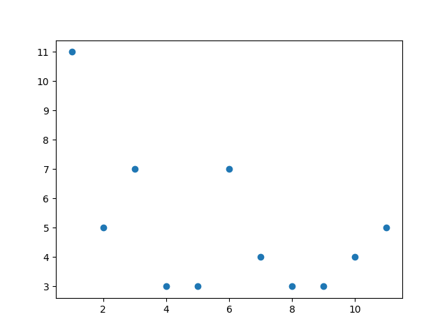
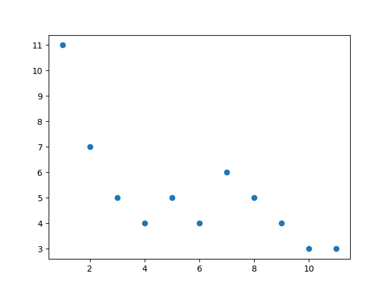
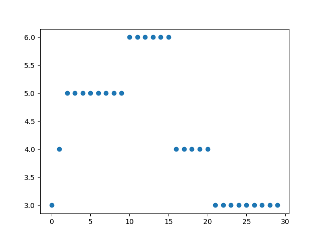
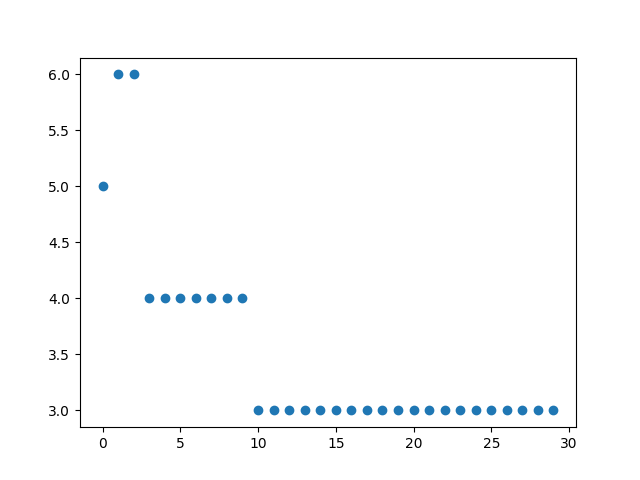

# Informe sobre solución al problema: La Venganza de Alejandra
## Equipo: $D^{aa}$
## Integrantes:
 - Andry Rosquet Rodríguez - C411
 - Rolando Sánchez Ramos - C411

## **1) Introducción al problema:**
En el archivo [La Venganza de Alejandra]() nos definen un problema donde se tiene un grafo, no dirigido, con aristas simples consideradas las relaciones entre los compañeros de Alejandra. El número de nodos y aristas del grafo serán denotados por $n$ y $m$ respectivamente en el resto del documento.

La solución del problema consiste en determinar si es posible eliminar aristas del grafo, de forma tal que el grafo resultante tenga a todos sus nodos con grado 3 ó 0, exceptuando el caso en que sea necesario eliminar todas las aristas del grafo para alcanzar tal condición. Lo anterior se traduce en que cada compañero de Alejandra termine com 3 o ninguna amistad.

Por último, es importante mencionar que tanto nodos como aristas serán enumerados indexando en $0$. Es decir, el primer nodo del grafo es el $0$ y no el $1$, lo cual no influye en ningún momento en la complejidad de las soluciones planteadas.
## **2) Soluciones:**
El desarrollo de la mejor solución encontrada al problema se expone de manera iterativa, es decir, inicialmente se demostrará la correctitud de una solución intuitiva, la cual se irá mejorando a medida que probemos una serie de proposiciones que nos permitirán optimizar la complejidad temporal de cada algoritmo implementado.

### **2.1) Solución Fuerza Bruta Recursividad:**
Se desea determinar si entre todas las variantes de escoger o no cierta arista, extendiendo la decisión a cada una de las pertenecientes al grafo, hay al menos una que haga cumplir con las condiciones del problema. O sea, se procederá generando el árbol de posibilidades que se nos otorga al poder quitar o dejar cierta arista. Para luego, con cada posibilidad analizarl si válida para solucionar el problema. 

**Idea general de solución:**

El método $brute\_force\_recursive$ será el encargado de controlar los casos esquinados como pueden llegar a ser:
1. El grafo inicial no tiene aristas.
2. Si dejando todas las aristas del grafo inicial, ya este es váido para la solución.

Además crea el array $bitmask$, en este, al valor $True$ se le corresponde la acción de dejar la arista en el grafo y $False$ removerla.
Luego, sino se encuentra en un caso esquinado, procederá a ejecutar $brute\_force\_recursion$. Este método recursivo tendrá como condición de parada haber iterado las $m$ aristas, esto gracias a la variable que el controla llamada arist. Cuando alcanza la condición de parada, significa que ya se tomó la decisión de remover o dejar cada arista y por tanto, es válido analizar si esta variación es válida. Si quedan aristas por decidir entonces, realiza los dos llamados recursivos posibles:
1. Dejar la arista y entonces se aumenta la variable arist en 1 para avanzar a la siguiente, si falta alguna por analizar.
2. Otorgarle a $bitmask$ en la posición de la arista que se está analizando el valor $False$ y aumentar en 1 arist. Entonces esta arista en el llamado recursivo ha sido removida.
Luego se deshacen los cambios para futuras combinaciones debido a que Python trabaja la lista $bistmask$ con referencia. Notar que se recorrerán todas las posibilidades, puesto que no existen más variantes que dejar o remover las aristas y la recursividad se encarga de conformar todas las variantes posibles.
El método, ya mencionado en par de ocasiones, encargado de comprobar la validez de la combinación de aristas es $is\_valid\_graph$. Este, intuitivamente iterará por cada arista del grafo y en un array llamado $degree\_vertex$ recogerá la información de los grados de cada nodo. Por cada arista, accede a los nodos que la conforman, para luego aumentar el grado de ambos en 1. El algoritmo irá controlando si algún nodo sobrepasa el grado 3, en dicho caso devolverá falso. Finalmente itera por el array $degree\_vertex$, donde analiza si los grados de cada nodo son 0 ó 3, únicamente. Además controla el caso esquinado donde todas las aristas hallan sido removidas, en dicho caso devuelve falso ya que incumple la condición de no eliminar todas las relaciones de amistad.

**Pseudocódigo:**
```
brute_force_recursive(n, m, edges):
    bitmask = [True for i in range(m)]
    if m == 0 or is_valid_graph(n, m, edges, bitmask):
        return True
    else:
        return brute_force_recursion(n, m, edges, bitmask, 0)

brute_force_recursion(n, m, edges, bitmask, arist):
    if arist == m:
        return is_valid_graph(n, m, edges, bitmask)
    
    arist+=1
    if brute_force_recursion(n, m, edges, bitmask, arist):
        return True
    bitmask[arist-1]=False
    if brute_force_recursion(n, m, edges, bitmask, arist):
        return True
    bitmask[arist-1]=True
    
    return False

is_valid_graph(n, m, edges, bitmask):
    degree_vertex = [0 for i in range(n)]

    for i in range(m):
        if bitmask[i]:
            a, b = edges[i]
            degree_vertex[a] += 1
            degree_vertex[b] += 1
            if degree_vertex[a] > 3 or degree_vertex[b] > 3:
                return False
    count=0   
    for degree in degree_vertex:
        if degree != 3 and degree != 0:
            return False
    for bit in bitmask:
        if not bit:
            count+=1
    if count == m:
        return False
    return True      
```
**Complejidad Temporal:**
Nos encontramos en presencia de un algoritmo recursivo que internamente llama el método de validación de la solución cada vez que alcanza la condición de parada. La complejidad de la recursividad resulta simple de determinar en este caso; notemos que se llamará a sí misma a lo sumo 2 veces y además se adentrará hasta que $arist$ alcance el valor de m. Por tanto, como $arist$ aumenta en 1 unidad con cada llamado podemos concluir que la complejidad de la recursividad, sin tener en cuenta los llamados al método de validación, será $O(2^m)$. Ahora, al considerar los llamados a $is\_valid\_graph$ vemos que la complejidad final será $O((m+2n)*2^m)$. Esto se debe a que el método anterior hace primero un recorrido por las $m$ aristas y luego dos ciclos por el array $degrees\_vertex$ con tamaño $n$. Finalmente la complejidad se puede reducir a solo $O(2^m)$, ya que se puede despreciar la parte polinomial.

### **2.2) Solución Fuerza Bruta con Máscara de Bits:**
Al igual que en el algoritmo anterior se desea iterar por cada posibilidad que nos otorga el remover o dejar una arista. Para luego, concluir si hay al menos una variante válida.

**Idea general de solución:**

El método $brute\_force\_bitmask$ iterará por las $2^m$ posibilidades que de manera intuitiva nos brinda el poder dejar o remover una arista del grafo. Lo anterior, lo hará usando como recurso máscaras de bits. El ciclo desde 1 a $2^m$ nos brinda la posibilidad de recorrer todos los números binarios con longitud $\leq$ m. Luego notemos que si elevamos $2^i$, con 0 $\leq$ i $\leq$ m, en binario estos números constituirán máscaras donde todos sus dígitos son 0 exceptuando la posición $i$.
Entonces con estas herramientas y con el uso de la operación Y Lógica(&) entre el número del ciclo exterior y las máscaras del ciclo interno, es que iremos ubicando $True$ o $False$ en la lista $bitmask$ que constituye la variación que se debe verificar.
Notar que se recorren todas las variaciones gracias a que como se explicó el ciclo externo estará constituido por todos los números desde 1 a hasta $2^m$, los cuales en binario son todas las variantes de ubicar 1s y 0s en $m$ casillas.

**Pseudocódigo:**
```
brute_force_bitmask(n, m, edges):
    bitmask = [True for i in range(m)]
    
    if m == 0 or is_valid_graph(n, m, edges, bitmask):
        return True
    
    for i in range(1, 2**m):
        for j in range(m):
            bitmask[j] = True if i & (2**j) else False
        if is_valid_graph(n, m, edges, bitmask):
            return True

    return False

is_valid_graph(n, m, edges, bitmask):
    degree_vertex = [0 for i in range(n)]

    for i in range(m):
        if bitmask[i]:
            a, b = edges[i]
            degree_vertex[a] += 1
            degree_vertex[b] += 1
            if degree_vertex[a] > 3 or degree_vertex[b] > 3:
                return False
    count=0   
    for degree in degree_vertex:
        if degree != 3 and degree != 0:
            return False
    for bit in bitmask:
        if not bit:
            count+=1
    if count == m:
        return False
    return True      
```

**Complejidad Temporal:**
La complejidad temporal de este algoritmo viene dada por el ciclo con $2^m$ iteraciones y dentro de cada una de estas iteraciones se lleva a cabo otro ciclo, este de longitud m, y un llamado a la función $is\_valid\_graph$ de la cual ya conocemos su complejidad (véase complejidad de solución fuerza bruta con recursividad $O(2n+m)$). Por tanto, el algoritmo tiene como complejidad temporal $O((2n+2m)*2^m)$.

### **2.3) Solución utilizando metaheurística:**
Una vez analizadas las soluciones anteriores, es posible notar una interesante aproximación en base a la distancia de soluciones parciales con respecto a una solución admisible para el problema en cuestión. En este caso, ideamos una aproximación polinomial donde en cada caso se seleccione como arista a eliminar, aquella que genere la mayor cantidad posible de nodos en un estado final correcto, es decir, el número de nodos tal que tengan grado 3 o 0. Evidentemente, conociendo el valor óptimo para dicho problema, podemos determinar la posibilidad o no de lograr el objetivo deseado, esto ya que si el óptimo es igual al número de nodos del grafo, entonces el resultado al problema de decisión es verdadero, mientras que en otro caso, es falso.

**Idea general de solución:** 
La idea de esta metaheurística es en todo momento seleccionar lo que definiremos como mejor arista a eliminar: Una arista es tan buena como candidata a eliminar como de cerca esté el estado en que queda el grafo al ser eliminada. En este caso, la calidad de un estado del grafo es la cantidad de nodos que estén en el estado deseado.

Es posible notar que con esta aproximación que quitando una arista, el estado nuevo en el que se coloca el grafo puede: 
- Disminuir en 2, en caso de que se quite de dos nodos con grado 3.
- Mantenerse igual, en caso de que los dos nodos conectados hayan estado previamente con grado mayor estricto a 4.
- Aumentar en 1, en los casos en que se quite una arista entre un nodo con grado mayor que 4 y uno con grado igual a 1 o igual a 4.
- Aumentar en dos en caso de que se desconecte la arista entre dos nodos de grado 1, o cuando estos dos tengan grado 4.
Por lo tanto, la mejora de quitar una arista será a lo sumo de 2 unidades respecto al estado anterior.

Luego el procedimiento realizado consiste en seleccionar alguna arista cuya calidad sea lo mayor posible, en este caso se tomó como decisión tomar la primera de estas, aunque tambíen se puede experimentar equivalentemente seleccionando una aleatoriamente del conjunto de las mejores en cuanto a calidad.

Dado que se realiza un algoritmo con un resultado aproximado a al problema de decisión en cuestión, es necesario notar que este es un proceso de optimización golosa, donde en cada momento se selecciona la arista candidata de mejor calidad sin verificar otras posibilidades. Por lo tanto la respuesta del algoritmo es un entero entre 0 y $n$, denotando el número máximo alcanzado de nodos que finalizaron en un estado deseado después de haber realizado las eliminaciones de aristas con el criterio anterior.

**Pseudocódigo:**
```
metaheuristic_solution(n, m, edges):
    bitmask = [True for i in range(m)]
    if m == 0 or is_valid_graph(n, m, edges, bitmask):
        return n
    else:
        maximum = [0]
        metaheuristic_solve(n, m, edges, bitmask, maximum)
        return maximum[0]

metaheuristic_solve(n, m, edges, bitmask, maximum):
    if bitmask == [False for i in range(m)]:
        return
    
    if is_valid_graph(n, m, edges, bitmask):
        maximum = [n]
        return
    
    valid_edge_indexes = get_valid_indexes(bitmask)
    sorted_indexes_by_quality = get_sorted_indexes_by_quality(valid_edge_indexes, n, m, edges, bitmask)
    _, index = sorted_indexes_by_quality[0]
    bitmask[index] = False
    maximum[0] = max(maximum[0], get_state_quality(n, m, edges, bitmask))
    return metaheuristic_solve(n, m, edges, bitmask, maximum)

get_valid_indexes(bitmask):
    indexes = []
    for i in range(len(bitmask)):
        if bitmask[i]:
            indexes.append(i)
    return indexes

get_sorted_indexes_by_quality(valid_edge_indexes, n, m, edges, bitmask):
    answer = []
    for index in valid_edge_indexes:
        bitmask[index] = False
        quality = get_state_quality(n, m, edges, bitmask)
        answer.append((quality, index))
        bitmask[index] = True
    answer.sort()
    return answer

get_state_quality(n, m, edges, bitmask):
    number_valid_nodes = 0
    degree_vertex = [0 for i in range(n)]

    for i in range(m):
        if bitmask[i]:
            a, b = edges[i]
            degree_vertex[a] += 1
            degree_vertex[b] += 1
    for d in degree_vertex:
        if d == 3 or d == 0:
            number_valid_nodes += 1
    return number_valid_nodes
```

**Complejidad Temporal:**
Primeramente, el método $get\_state\_quality$ se ejecuta en $O(n + m)$, pues se recorre el conjunto bitmask que denota la decisión de quitar o no una arista entre las $m$ posibles y luego se recorren los grados correspondientes a los $n$ nodos del grafo. Por otro lado, el método $get\_sorted\_indexes\_by\_quality$ tiene complejidad $O(m*(n + m) + m\log{m})$, ya que por cada posible índice válido obtenido del método $get\_valid\_indexes$, se obtiene en $O(m)$ ya que analiza aquellos índices de las aristas que pueden eliminarse y por cada uno de dichos índices se procede a calcular la calidad del estado en el cual estos dejan al grafo después de eliminar la arista correspondiente y luego se realiza una ordenación entre dichos índices, donde el peor caso es cuando se pueden eliminar cualquiera de las aristas del grafo. Finalmente, se obtiene un algoritmo de a lo sumo $O(m*(m*(n + m) + m\log{m}))$, ya que en cada momento se analiza de las aristas posibles cuál quitar y en el peor caso, sería necesario llegar a la situación inválida donde se intentan quitar todas.

### **2.4) Solución utilizando genetic algorithm:**
Siguiendo la misma línea de pensamiento de la solución anterior, ahora también deseamos desplazarnos a través de aproximaciones a lo que sabemos es el óptimo de nuestro problema.

**Idea general de solución:** 
La idea de este algoritmo es generar una población acotada y constante (50 si hay menos de 10 aristas y 200 si hay más) de posibles soluciones para nuestro problema gracias a $random\_solutions$. Para luego analizarlas según el grado de los nodos que resulten de los subgrafos generados por dichas soluciones. Esto lo hace el método $make\_calculations$, este basado en el siguiente criterior de penalización siguiente:
1. No penalizará si el nodo ya tiene grado 0 ó 3.
2. Penalizará con 1 a los nodos con grado 1 y 2.
3. Calculará la diferencia entre 3 y los nodos con grado mayor que 3 y esta será su penalización.
4. Si nos encontramos en el caso indeseado, que todos los nodos tienen grado 0, procede a penalizar con la cantidad de aristas del grafo inicial. Esto, con el objetivo que ignore lo mayormente posible este caso.
sumará la penalización total y se la asociará a la solución.
Luego de manera glotosa nos quedaremos con las $\log_2{m}$ menos penalizadas. Si hablamos de $iterative\_genetic$ la solución final de la iteración anterior será agregada a las $\log_2{m}$ soluciones escogidas. Finalmente, para la solución final se determina cuál fue la decisión más común entre la muestra final de soluciones con respecto a cada arista. Por tanto, la arista $i$ se decide remover si más del 50% de las soluciones decidieron removerla, de igual manera para si se desea dejar. Podemos notar gracias a imágenes y resultados obtenidos, que aunque en algunos casos puede llegar a mostrar mejoras en cada iteración no es fiable, no determina la solución óptima y no hace tender a 0 la función de penalización en todos los casos. Podemos notar también que el factor aleatorio de generar la población inicial juega un importante papel porque en ejecuciones de casos distintos, relacionados o no, se obtienen resultados impredecibles.

**Ejemplos de Resultados como Aproximación al Problema:**





**Pseudocódigo:**
```
from random import randrange
import matplotlib.pyplot as plt
import numpy as np
import math

def generate_test_cases(number_test_cases):
    test_cases = []

    for i in range(number_test_cases):
        n = randrange(6,7) 
        m = 0
        edges = []
        for j in range(n-1):
            for k in range(j, n):
                if j != k and randrange(0, 2):
                    edge = (j, k)
                    edges.append(edge)
                    m += 1
        test_cases.append((n, m, edges))
    return test_cases

def genetic_algorithm(graph,iterative_solution):
    m=graph[1]
    n=graph[0]
    edges=graph[2]
    solutions=random_solutions(m)
    dict_penalties={}

    for i in range(len(solutions)):
        degrees=get_degrees(n,solutions[i],edges)
        penalty=make_calculation(degrees,m)
        if dict_penalties.get(penalty) == None:
            dict_penalties[penalty]=[solutions[i]]
        else:
            dict_penalties[penalty].append(solutions[i])


    ordered_penalties = sorted(dict_penalties)
    new_solutions=[]
    if iterative_solution != []:
        new_solutions.append(iterative_solution)
            
    i=0
    while len(new_solutions)<= int(math.log2(m)):
        for j in dict_penalties[ordered_penalties[i]]:
            new_solutions.append(j)
        i+=1
    new_solutions= [new_solutions[i] for i in range(int(math.log2(m)))]
    
    final_solution=compare_solutions(new_solutions)
    final_penalty=make_calculation(get_degrees(n,final_solution,edges),m)
   
    return final_solution,final_penalty 

def compare_solutions(solutions):
    final_solution=[]
    trues=0
    falses=0
    for i in range(len(solutions[0])):
        for j in range(len(solutions)):
            if solutions[j][i]:
                trues+=1
            else:
                falses+=1
        if trues>=falses:
            final_solution.append(True) 
        else:
            final_solution.append(False)  
        trues=0
        falses=0    
    return final_solution

def get_degrees(n,bitmask,edges):
    degree_vertex = [0 for i in range(n)]

    for i in range(len(edges)):
        if bitmask[i]:
            a, b = edges[i]
            degree_vertex[a] += 1
            degree_vertex[b] += 1
    return degree_vertex

def random_solutions(m):
    if m<6:
        raise Exception("Imposible graph, it should have more than 6 arist at least")
    if m<10:
        number_solutions= 50
    else:
        number_solutions=200
    solutions=[]
    while len(solutions) !=number_solutions:
        posible_solution=generate_solution(m)
        if differents_solutions(posible_solution,solutions):
            solutions.append(posible_solution)
    return solutions

def differents_solutions(posible_solution,solutions):
    if len(solutions)==0:
        return True
    for i in solutions:
        if i==posible_solution:
            return False
    return True    

def generate_solution(m):
    solution=[]
    for i in range(m):
        r=randrange(0,2)
        if r==1:
            solution.append(True)
        else:
            solution.append(False)
    return solution

def difference_cost(x):
    if x == 0 or x == 3:
        return 0
    elif x == 1 or x == 2:
        return 1
    else:
        return x - 3

def make_calculation(degrees,m):
    if sum(degrees)==0:
        return m

    fit = 0
    for i in degrees:
        fit += difference_cost(i)
    return fit


def genetic_same_graph_different_population():
    graph = generate_test_cases(1)[0]
    degrees = get_degrees(graph[0],[True for i in range(graph[1])],graph[2])
    initial_penalty = make_calculation(degrees,graph[1])

    results=[]
    results.append(initial_penalty)
    x=[1,2,3,4,5,6,7,8,9,10,11]

    for i in range(10):
        final_solution,final_penalty=genetic_algorithm(graph,[])
        results.append(final_penalty)

    plt.plot(x,results,"o")
    plt.show()
    
def iterative_genetic():
    graph = generate_test_cases(1)[0]
    results=[]
    final_solution=[]
    x=[i for i in range(30)]

    for i in range(30):
        final_solution,final_penalty=genetic_algorithm(graph,final_solution)
        results.append(final_penalty)

    plt.plot(x,results,"o")
    plt.show()
```

**Complejidad Temporal:**
Primeramente, en el método $random\_solutions$ notemos que es generada una muestra entera y fija de soluciones. Estas son iteradas en  $genetic\_algorithm$, mientras se llama a  $get\_degrees$ y  $make\_calculations$. El primero antes mencionado realiza un labor antes exxplicada iterando por cada arista para calcular el grado de cada nodo, por tanto posee una complejidad $O(m)$. El segundo iterapor cada degree por tanto su complejidad es $O(n)$ ya que esta lista estará conformada por los grados de todos los nodos. El proceso de escoger las $\log_2{m}$ """mejores soluciones""" será $O(\log_2{m})$, porque son agregadas de 1 en 1. Por último el método $compare\_solutions$ que itera por la longitud de las soluciones a la vez que por la cantidad de soluciones, esto resulta en una complejidad de $O(m*\log_2{m})$. Finalmente se hace un llamado a $make\_calculations$, para así obtener una complejidad temporal final igual a $O(m+n+\log_2{m}+m*\log_2{m})$. Lo anterior puede ser traducido a sólo $O(n+m*\log_2{m}) dónde dependiedno de la cantidad de nodos y de aristas uno de los dos miembros toma más importancia.

### **2.5) Demostración de la NP-completitud del problema:**

**Nociones básicas:**

En teoría de la complejidad computacional, la clase de complejidad NP-completo es el subconjunto de los problemas de decisión en NP tal que todo problema en NP se puede reducir en cada uno de los problemas de NP-completo. Se puede decir que los problemas de NP-completo son los problemas más difíciles de NP y muy probablemente no formen parte de la clase de complejidad P. La razón es que de tenerse una solución polinómica para un problema NP-completo, todos los problemas de NP tendrían también una solución en tiempo polinómico. Si se demostrase que un problema NP-completo, llamémoslo A, no se pudiese resolver en tiempo polinómico, el resto de los problemas NP-completos tampoco se podrían resolver en tiempo polinómico. Esto se debe a que si uno de los problemas NP-completos distintos de A, digamos X, se pudiese resolver en tiempo polinómico, entonces A se podría resolver en tiempo polinómico, por definición de NP-completo. Ahora, pueden existir problemas en NP y que no sean NP-completos para los cuales exista solución polinómica, aun no existiendo solución para A.

Por ejemplo para el caso específico de nuestro problema, dado un grafo $G$, si se tiene un subgrafo del mismo, es fácil corroborar que este cumple con las condiciones establecidas en el problema.

*Grafos Cúbicos:*

El problema en particular que tratamos puede ser reducido al hecho de encontrar un subgrafo regular de grado $3$ de un grafo arbitrario dado como entrada. Vemos que esto es equivalente a lo que se pide en nuestro problema pues si encontramos tal subgrafo, este tendría una cantidad de aristas menor o igual a la del grafo inicial, con lo cual se pudiese inferir que el proceso de quitar aristas hasta que todo nodo cumpla que, o tiene grado $3$ o tiene grado $0$. Dichos subgrafos son conocidos como grafos cúbicos.

En teoría de grafos, un grafo cúbico o grafo trivalente es un grafo cuyos vértices son todos incidentes a exactamente tres aristas. En otras palabras, un grafo cúbico es un grafo 3-regular.

*Problema NP-Completo:*

Nuestro problema es un problema de decisión, ya que su respuesta se basa en afirmar o negar una sentencia, en este caso, si para un grafo dado, existe una reducción de aristas, de no todas a la vez, tal que el grafo resultante cumpla que cada nodo tiene grado 3 o 0. Ahora, un problema de decisión C es NP-completo si:

1. C es un problema NP
2. Todo problema de NP se puede transformar polinómicamente en C.

Se puede demostrar que C es NP demostrando que un candidato a solución de C puede ser verificado en tiempo polinómico.

Una transformación polinómica de L en C es un algoritmo determinista que transforma instancias de l ∈ L en instancias de c ∈ C, tales que la respuesta a c es positiva si y sólo si la respuesta a l lo es.

Como consecuencia de esta definición, de tenerse un algoritmo en P para C, se tendría una solución en P para todos los problemas de NP.

Es entonces en base a dichas ideas, que probaremos la NP-completitud de nuestro problema a partir de la demostración del siguiente teorema:


**Teorema 2.5.1)** El problema de encontrar un subgrafo k-regular para un grafo $G$ es NP-completo para $k \geq 3$. (Problema k-R)

**Demostración:** El problema planteado es NP, esto, dado que es posible en tiempo polinomial determinar si una solución referente a una instancia del mismo es correcta, es decir, para un subgrafo dado como respuesta, es posible determinar si el mismo cumple que todo nodo tiene grado $k$ simplemente recorriendo el conjunto de las aristas de este y aumentando en uno el grado de los nodos conectados en la misma.

Es conocido que el problema de determinar si un grafo es 3-coloreable (problema 3-C) es NP-completo, ya que dicha condición fue demostrada por [Karp](https://link.springer.com/chapter/10.1007/978-1-4684-2001-2_9) en 1972. Luego, teniendo esto en cuenta, el objetivo será reducir el problema 3-C al problema k-R. Además, denotemos por $K_k'$ el grafo completo con $k$ vértices con una arista faltante.

Dado un grafo arbritrario $G$ como entrada al problema 3-C, con $V(G) = \{v_1, v_2, \cdots, v_n\}$ y $E(G) = \{e_1, e_2, cdots, e_m\}$, podemos construir un nuevo grafo $G'$ de la siguiente manera:

1. Para cada nodo $v_i$ en $G$, construyamos $3$ ciclos $C_i^1, C_i^2, C_i^3$ en $G'$, cada uno con longitud $2d(v_i) + 1$. Ahora, denotemos los vértices en $C_i^h$ como $c_{ij}^h$, con $1 \leq i \leq n, 1 \leq j \leq 2d(v_i) + 1$ y $1 \leq h \leq 3$.

2. Para cada arista $e_j$, con $1 \leq j \leq m$, construyamos $3(k-2)$ subgrafos correspondientes denotados como $D_{jp}^h$ en $G'$, con $1 \leq p \leq k-1, 1 \leq h \leq 3$, donde cada $D_{jp}^h$ es un grafo $K_{k+1}'$. Además, denotemos los dos vértices con grado $k-1$ en $D_{jp}^h$ como $x_{jp}^h$ e $y_{jp}^h$.

3. Sea la arista $e_j$ incidente sobre los vértices $v_s$ y $v_t$ en $G$. Para cada $h$, $1 \leq h \leq 3$, sean $c_{s\alpha}^h$ y $c_{s\beta}^h$ ($c_{t\gamma}^h$ y $c_{t\delta}$) dos vértices en $C_s^h$ ($C_t^h$) tales que $c_{s\alpha}^h$ y $c_{s\beta}^h$ ($c_{t\gamma}^h$ y $c_{t\delta}$) tengan grado dos. Para $1 \leq p \leq 3(k-2)$, agreguemos las aristas $(c_{s\alpha}^h, x_{jp}^h), (c_{s\beta}^h, y_{jp}^h), (c_{t\gamma}^h, x_{jp}^h)$ y $(c_{t\delta}^h, y_{jp}^h)$ al conjunto de aristas $E(G')$.
Una vez que todas las aristas en $G$ hayan sido consideradas en el paso $3.$, cada cilco $C_i^h$ ($1 \leq i \leq n, 1 \leq h \leq 3$) contendrá exactamente un vértice de grado dos. Nombremos estos vértices como $w_i^h$, con $1 \leq i \leq n, 1 \leq h \leq 3$.

4. Para $1 \leq i \leq n$, sea $U_i$ un subgrafo formado como: $U_i$ contiene $(k-2)$ veces el grafo K_{k+1}' y $(k-2)$ otros vértices. Denotemos estos otros vértices como $u_{ij}$, y los vértices en $K_{k+1}'$ con grado $k-1$, $x_{ij}$ e $y_{ij}$ con $1 \leq j \leq k-2$. Luego, unamos los vértices $u_{ij}$ con los grafos $K_{k+1}'$ añadiendo las aristas $(u_{ij}, x_{ij})$. Luego, añadimos los subgrafos $U_1, U_2, \cdots, U_n$ y las aristas $(u_{ij}, w_i^1), (y_{ij}, w_i^2)$ y $(y_{ij}, w_i^3)$  a $G'$. Esto lo hacemos para cada $i$ y $j$, con $1 \leq i \leq n, 1 \leq j \leq k-2$.

5. Finalmente, añadimos un ciclo $C'$ de longitud $(k-1)n$ a $G´$; este ciclo es sobre los nuevos vértices $a_{11}, a_{12}, \cdots, a_{1n}, a_{21}, \cdots, a_{(k-1)n}$. Para $1 \leq i \leq n, 1 \leq j \leq k-2$ y $1 \leq p \leq k-1$, añadimos las aristas $(a_{pi}, u_{ij})$ a $G'$.

Es evidente que la construcción del grafo $G'$ puede ser realizada en tiempo polinomial para cualquier grafo $G$ dado. Ahora, la demostración principal del teorema consiste en probar que: *Un grafo $G$ es 3-coloreable si y solo si el grafo $G'$ construido contiene un subgrafo k-regular.*

($\Rightarrow$) Dado el grafo $G$ y cualquier tripartición de $V(G)$ en subconjuntos $V_1, V_2$ y $V_3$, podemos construir un subgrafo de $G'$, al cual denotaremos por $H$, de la siguiente manera:

1. Todos los vértices $a_{ij}$, $1 \leq i \leq k-1, 1 \leq j \leq n$ están en $V(H)$.
2. Todos los vértices $u_{ij}$, $1 \leq i \leq n, 1 \leq j \leq k-2$ están en $V(H)$.
3. Si $v_i$ de $G$ está en el subconjunto $V_c$, $1 \leq c \leq 3$, entonces el ciclo $C_i^c$ está en $H$. Si el subconjunto $V_c$ no está en $V_1$, entonces se añaden también los vértices en los $k-2$ grafos $K_{k+1}'$ de $U_i$.

4. Si la arista $e_j$, $1 \leq j \leq m$, es adjacente al vértice $v_s$ el cual está en el subconjunto $V_c$, entonces los subgrafos $D_{jp}^c$ adyacentes a $C_s^c$ están en $V(H)$ para $1 \leq p \leq k-2$.
5. El subgrafo $H$ se define como $G'[V(H)]$.

Es trivial comprobar que el subgrafo $H$ contruido existe para cualquier tripartición de $G$. Además, todos los vértices en $H$ tienen grado $k$ excepto posiblemente dichos vértices $x_{jp}^c$ e $y_{jp}^c$ en $D_{jp}^c$ para $1 \leq j \leq m, 1 \leq p \leq k-2$ y $1 \leq c \leq 3$. Por lo tanto, es fácil notar que si la tripartición es una coloración, por ejemplo, $G$ es 3-coloreable, entonces el subgrafo $H$ construido es k-regular.

($\Leftarrow$) Asumamos que $G'$ contiene un subgrafo k-regular $H$, las siguientes propiedades son verdad respecto a $H$:

1. Todos los vértices $a_{ij}$ y $u_{jl}$, $1 \leq i \leq k-1, 1 \leq j \leq n$ y $1 \leq l \leq k-2$ están en $V(H)$. Esto es debido a que el subgrafo $H$ no puede ser k-regular sin la inclusión de un vértice $u_{jl}$, pero la inclusión de uno de dichos vértices obliga a que todos los vértices en $C'$ y otros vértices $u_{jl}$ sean incluidos.
2. Para cada $i$, $1 \leq i \leq n$, exactamente uno del ciclo $C_i^h$, $1 \leq h \leq 3$, está en $V(H)$.
3. Para cada $i$, $1 \leq i \leq n$, si $C_i^h \subseteq H$, entonces $C_j^h \not\subseteq H$ para todo $j$ tal que $(i, j) \in E(G)$. Esto asegura que todos los vértices $x_{jp}^h$ e $y_{jp}^h$, $1 \leq j \leq m$, $1 \leq p \leq k-2, 1 \leq h \leq 3$, tienen grado $3$.

Por la propiedad $2.$, se llega a que el subgrafo $H$ de $G'$ corresponde a una tripartición para los vértices de $G$ tal que un vértice $v_i$ está en una partición $c$ si el ciclo $C_i^c \in H$. La propiedad $3.$ asegura que los vértices adyacentes están en una partición diferente, por lo tanto, esto muestra que la tripartición correspondiente a $H$ es de hecho una coloración de $G$. Por lo tanto, $G$ es 3-coloreable si $G'$ contiene un subgrafo k-regular $H$. De esta forma se completa la demostración.□

Una vez demostrado el teorema anterior, vemos que demostramos también que el problema enfrentado en este proyecto es $NP-completo$, esto dado que si lo reducimos para $k=3$, se cumple por el teorema anterior. Luego, dado ese subgrafo 3-regular que se asegura para un grafo arbitrario en caso de que lo tenga, bastaría con quitar las aristas necesarias para llegar a él como parte de la solución de la situación planteada, donde estará un subgrafo regular y posiblemente, otros nodos con grado $0$, lo cual corresponde con la validez de una solución buscada.

### **2.5) Formalizando una aproximación para el problema:**
Muchos problemas de importancia práctica son NP-completos, pero son demasiado relavantes como para abandonar su estudio simplemente porque no sabemos cómo encontrar una solución óptima en tiempo polinomial. Incluso si un problema es NP-completo, puede haber esperanza. Existen algunas vías para enfrentar la complejidad de dichos problemas. Primero, si las entradas reales son pequeñas, un algoritmo con tiempo de ejecución exponencial puede ser perfectamente satisfactorio. Segundo, podemos ser capaces de aislar casos especiales importantes que podemos resolver en tiempo polinómico. En tercer lugar, podríamos idear enfoques para encontrar soluciones casi óptimas en tiempo polinomial (ya sea en el peor de los casos o en el caso esperado). En la práctica, lo "casi óptimo" es a menudo lo suficientemente bueno. Llamamos a un algoritmo que devuelve soluciones casi óptimas un algoritmo de aproximación.

Decimos que un algoritmo para un problema tiene una razón de aproximación de $\rho(n)$ si, para cualquier entrada de tamaño $n$, el costo $C$ de la solución hallada por el algoritmo está dentro de un factor de $\rho(n)$ del costo $C^*$ de una solución óptima: $max(\frac{C}{C^*}, \frac{C^*}{C}) \leq \rho(n)$.

**Idea General de la Solución:** En este caso, proponemos un algoritmo de aproximación en tiempo polinomial tal que este pueda generar soluciones cercanas a la solución óptima de una instancia del problema con un error de aproximación formalmente acotado.

La idea del algoritmo es, para un grafo arbitrario $G$ tal que se quiere determinar si este tiene algún subgrafo cúbico o no, determinar el subgrafo que tenga la mayor cantidad posible de nodos en un estado correcto (grado 0 o 3) y que se cumpla además, que se asegura la existencia de al menos un nodo con grado 3. Sea $G'$ el subgrafo de $G$ resultante de optimizar el criterio anterior, nótese que al asegurar la presencia de al menos un nodo de grado mayor o igual a 3, entonces, podemos acotar el costo óptimo resultante para $G'$ por $n-3$ como mínimo, ya que pudiésemos solamente dejar en el grafo las aristas que conecta al nodo con grado mayor o igual a 3 con 3 adyacentes cualesquiera a este. En dicho caso, existirían como nodos en estado correcto en el grafo, todos, excepto los adyacentes, que son 3, por lo tanto, como mínimo se obtendría de respuesta $n-3$. Es importante analizar que, en caso de que en el grafo $G$ inicial no hayan nodos con grado mayor o igual a 3 entonces no es posible obtener un subgrafo cuyos nodos todos sean de grado 3 o 0 sin quitar todas las aristas, pues no habría ninguno de grado 3, luego habría que llevarlos todos a grado 0, lo que implicaría quitar las aristas presentes.

Ahora, formalicemos la calidad de la aproximación propuesta. Podemos notar que, para que el problema de decisión para una instancia del problema sea verdadero, entonces la solución óptima debe tener $n$ nodos (todos los del grafo) en estado correcto, y en caso contrario sería falso. Sin embargo, en este caso estamos buscando una forma de dar respuestas lo más cercanas posibles a dicho estado óptimo, independientemente de si es posible o no alcanzarlo.

Denotemos como $f$ la función que representa el costo de una solución del problema de planteado. Dado que conocemos que se asegura la presencia de un nodo de grado 3 en la aproximación resultante, el valor de costo de dicha función será de $f(G') \geq n-3$, donde $G'$ es el subgrafo asociado a un grafo $G$ donde se dejaron solamente las aristas asociadas a un nodo con grado mayor o igual a 3 conectando a 3 adyacentes cualesquiera de este. Luego, sea $G''$ el subgrado de $G$ tal que el valor $f(G'')$ es óptimo, el cual puede ser a lo sumo $n$ (en cuyo caso es verdadero el problema de decisión). Tentativamente, $f(G'') \geq f(G')$, por lo tanto, teniendo en cuenta que estamos maximizando la función de costo dada tenemos que $\frac{f(G'')}{f(G')} = \frac{C*}{C}$, pero $\frac{f(G'')}{f(G')} = \frac{f(G'')}{n-3} \leq \frac{n}{n-3}$. Por lo tanto, si hacemos $\rho(n) = \frac{n}{n-3}$, entonces llegamos a que el algoritmo planteado anteriormente constituye formalmente una $\rho(n)$-aproximación del problema dado. Luego, podemos ver que la fracción $\frac{n}{n-3}$ nos permitirá acotar la calidad de la solución a partir de un valor fijo, es decir, si se toma por ejemplo $n$ mayor o igual a 6, se tiene que dicha fracción sería menor o igual a $2$, por lo que para grafos con 6 o más nodos, esta vía constituye una $2$-aproximación del problema planteado. Igualmente, para $n\geq 4$ contituye una $4$-aproximaxión.

**Pseudocódigo:**
```
approx_solution(n, m, edges):
    return n-3 if is_node_degree_3(n, m, edges) else 0

is_node_degree_3(n, m, edges):
    degrees = [0 for i in range(n)]
    for i in range(m):
        node1, node2 = edges[i]
        degrees[node1] += 1
        degrees[node2] += 1
        if degrees[node1] >= 3 or degrees[node2] >= 3:
            return True
    return False
```

**Complejidad Temporal:**
La complejidad temporal de la función $is\_node\_degree\_3$ es $O(n + m)$, ya que recorre todas las arista donde va actualizando un array de tamaño $n$ donde calcula para cada nodo del grafo su grado, y retorna True si existe alguna con grado mayor o igual a 3 y False en caso contrario, Luego, la función $approx\_solution$ llama a la anterior en una sola instrucción que tiene como costo la ejecución de dicha primera función, por lo cual la aproximación tiene como complejidad temporal temporal $O(n + m)$.

## **3) Implementación del proyecto:**
El proyecto está dividido en tres secciones principales: Soluciones, Informe y Pruebas. Todas las implementaciones fueron realizadas con el lenguaje de programación $Python$. El punto de entrada para la ejecución del proyecto es el archivo $main.py$ en el directorio principal. Desde este se pueden ejecutar los scripts en las carpetas de *Soluciones* y *Pruebas* importando el archivo y los métodos específicos que se deseen ejecutar.

Para ejecutar el proyecto sólo es necesario ejecutar el archivo $main.py$ el cual por defecto tiene la implementación para hallar la solución de una instancia del problema. Una vez ejecutamos este script se debe dar de entrada los valores $n$ y $m$ en una misma línea, denotando las dimensiones del grafo que queremos crear, luego en las siguientes $m$ líneas se deben escribir duplos de la forma $(x, y)$ denotando una arista entre los nodos $x$ e $y$.
A continuación se muestra un ejemplo de flujo de entrada y salida por consola:
```
Input:
6 7
0 1
0 2
0 3
1 2
1 3
2 3
0 4
```
```
Output:
True
```

- **Soluciones:**
En esta carpeta se encuentran las distintas soluciones probadas para resolver el problema planteado. Todas contienen en esencia un método principal que recibe una entrada en el formato $n, m, edges$ donde $n$ y $m$ son la cantidad de nodos y aristas del grafo respectivamente y $edges$ el es conjunto de aristas. Como salida de estos métodos se da un valor booleano que representa la respuesta a la interrogante de si es posible, con el uso o no de la operación de quitar aristas del grafo original dado (no todas a la vez), el grafo resultante cumpla que cada nodo tiene grado $3$ o $0$.

- **Informe:** Constituye el resumen de los experimentos llevados a cabo en el proyecto y contiene las demostraciones que prueban la correctitud de los mismos.

- **Pruebas:** Contiene el script [algos_output_tester.py](), el cual genera casos de prueba aleatorios y compara las salidas de las soluciones implementadas y comprueba la igualdad en la salida de estas para mostrar su equivalencia. También se incluyó el archivo [tester.py]() que contiene la función *test_solution(...)* que recibe de entrada una función que resuelve el problema y se desea evaluar y luego se comparan las respuestas de esta con las del método de solución $brute\_force\_recursive$ y finalmente se da como retorno "Accepted!!" si coincidieron todas las respuestas y "Wrong Answer!!" en caso contrario. 
